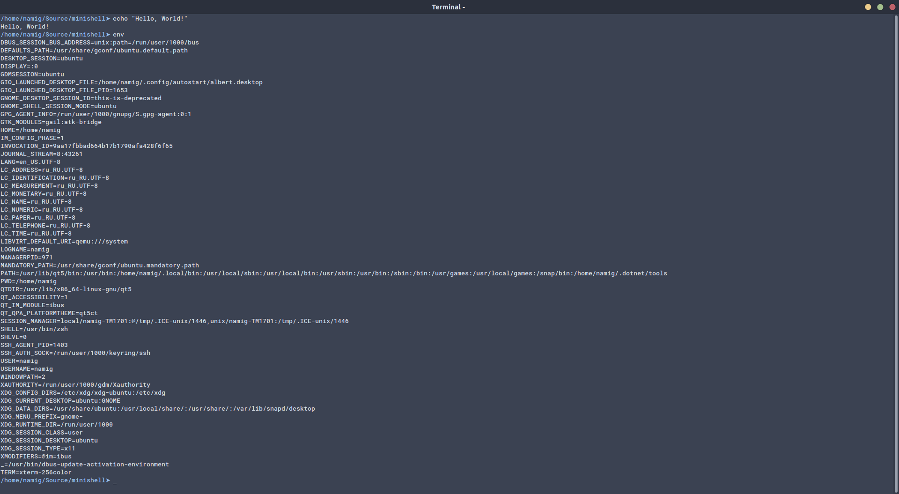

# minishell

<p align="center">
  
</p>

## About

### Instructions

- You must program a *mini UNIX command interpreter*.
- This interpreter must display a prompt (a simple `> ` for example)
  and wait till you type a command line, validated by pressing enter.
- The prompt is shown again only once the command has been completely executed.
- The command lines are simple, no pipes, no redirections
  or any other advanced functions.
- The executable are those you can find in the paths indicated
  in the PATH variable.
- In cases where the executable cannot be found,
  it has to show an error message and display the prompt again.
- You must manage the errors without using `errno`,
  by displaying a message adapted to the error output.
- You must deal correctly with the PATH
  and the environment (copy of system char `**environ`).
- You must implement a series of builtins:
  - `cd`
  - `setenv`
  - `help`
  - `pwd`
  - `clear`
  - `echo`
  - `eval`
  - `exit`

#### Allowed Functions

- malloc, free
- open, close, read, write
- opendir, readdir, closedir
- fork, execve
- wait
- exit

## Project Structure

### Source files

```
src
├── builtins
│   ├── cmd_cd.c
│   ├── cmd_clear.c
│   ├── cmd_echo.c
│   ├── cmd_env.c
│   ├── cmd_eval.c
│   ├── cmd_exit.c
│   ├── cmd_help.c
│   ├── cmd_pwd.c
│   └── cmd_setenv.c
├── commands.c
├── env.c
├── minishell.c
├── parser.c
├── path.c
├── process.c
└── utilities.c

1 directory, 16 files

```

### Header files

```
includes
└── minishell.h

0 directories, 1 file

```
